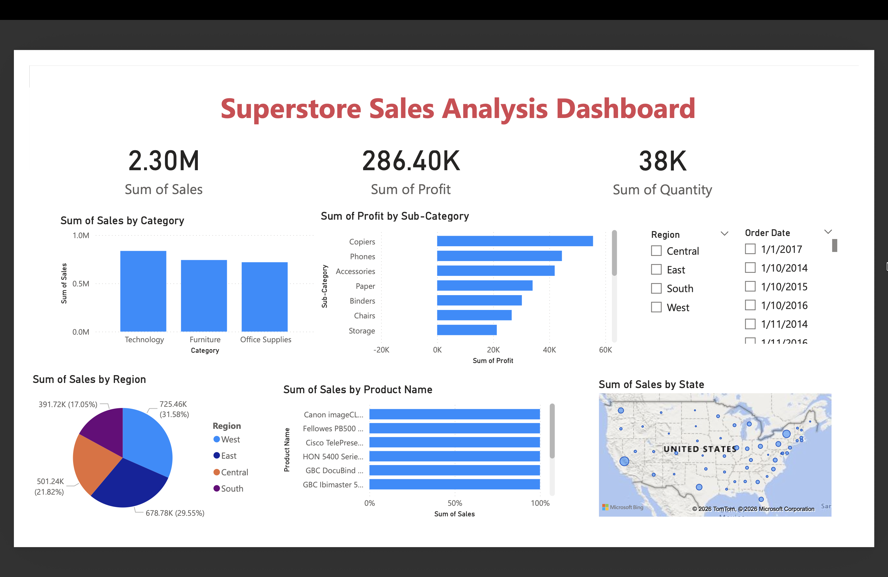

# Superstore Sales Analysis Dashboard

## Project Overview
This project analyzes retail sales data using Power BI.

The dashboard provides insights into:
- Total Sales
- Total Profit
- Total Quantity Sold
- Sales by Category
- Profit by Sub-Category
- Regional Sales Distribution
- Top Products by Sales
- Sales Trend Over Time

## Tools Used
- Power BI
- Data Visualization
- Business Intelligence

## Dataset
Superstore sales dataset.

## Dashboard Preview

